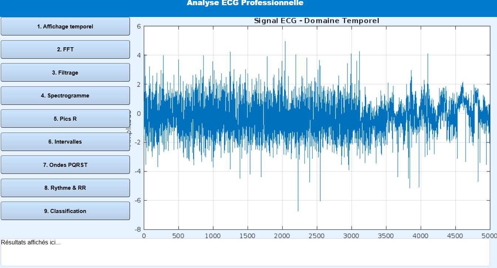
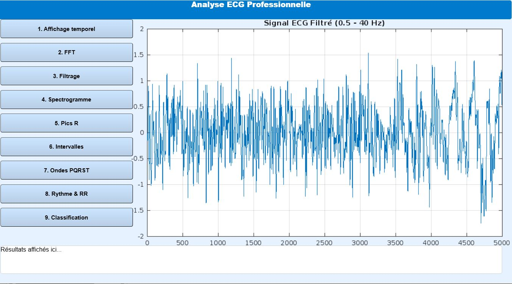
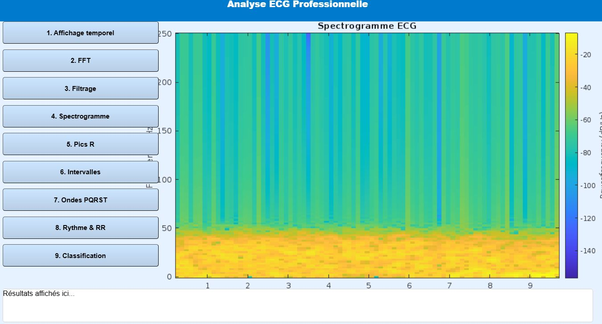
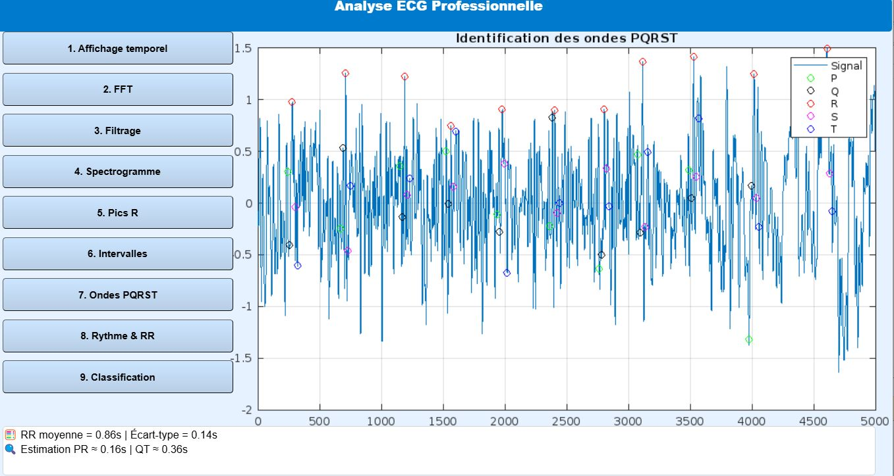

# 🫀 ECG Signal Analysis & Classification GUI (MATLAB)

## 📌 Description

This project is a professional MATLAB GUI for analyzing ECG (Electrocardiogram) signals.
It provides advanced signal processing, feature extraction, and machine learning classification.

---

## 🚀 Features

* 📈 Time-domain ECG visualization
* 🔊 Frequency analysis (FFT)
* 🧹 Signal filtering (Bandpass 0.5–40 Hz)
* 🌊 Spectrogram analysis
* ❤️ R-peak detection
* 📊 RR interval & heart rate calculation
* 🔬 PQRST wave identification
* 🤖 ECG classification using:

  * Support Vector Machine (SVM)
  * K-Nearest Neighbors (KNN)

---

## 🛠️ Technologies

* MATLAB
* Signal Processing Toolbox
* Machine Learning Toolbox

---

## ▶️ How to Use

1. Run the file:

```matlab
ECG_GUI_Pro
```

2. Upload ECG file (.csv or .mat)

3. Use buttons to:

* Analyze signal
* Detect peaks
* Compute heart rate
* Classify ECG

---

## 📊 Results

* Accurate R-peak detection
* Reliable heart rate estimation
* Classification using SVM and KNN

---

## 📸 Résultats & Visualisations

### 📈 Signal ECG (domaine temporel)


### 🧹 Signal ECG filtré


### 🌊 Spectrogramme


### ❤️ Identification des ondes PQRST


## 🎯 Project Goal

To apply signal processing and machine learning techniques for ECG analysis in biomedical applications.

---

## 📷 Future Improvements

* Deep Learning (CNN for ECG classification)
* Real-time ECG analysis
* GUI enhancement

---

## 👩‍💻 Author

Nada Bouali
Biomedical Engineering Student
